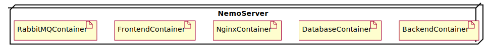

# Nemo

Nemo is a web service whose main task is to display the online status of any [maturity model](https://en.wikipedia.org/wiki/Maturity_model) for any project defined in it. It also provides some other facilities such as setting a goal to reach a level in maturity model and more.


## Configuration of Nemo

You can find nemo configuration description on [configuration guidline](CONFIGURATION-GUIDLINE.md).

## Nemo Architecture

### Deployment View

The following deployment diagram is being deployed in Nemo server via the specification of this [`docker-compose.yml`](docker-compose.yml).



`Dory` is a seperate module and being deployed in another server. To see what it is and how it is deploying, check it out [here](../dory-server/).

### Major Components

The following diagram demonstrates the dependencies between major components used in Nemo.


You can read more about these components that we developed.

- [Backend](backend/)
- [Frontend](frontend/)

- Run this command in terminal

``` bash
docker-compose up --build -d
```

**If you want to develop backend/frontend and see the live service by any change, please read [Live-Development](live-development/)**

#### Owner : @sharifzadeh
